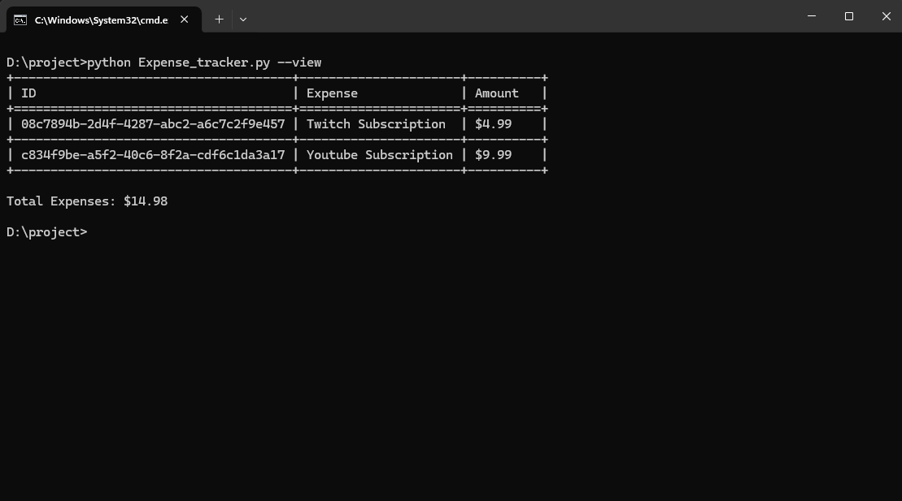
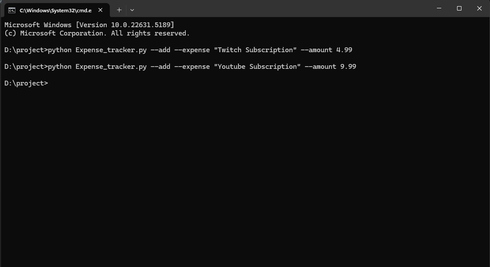
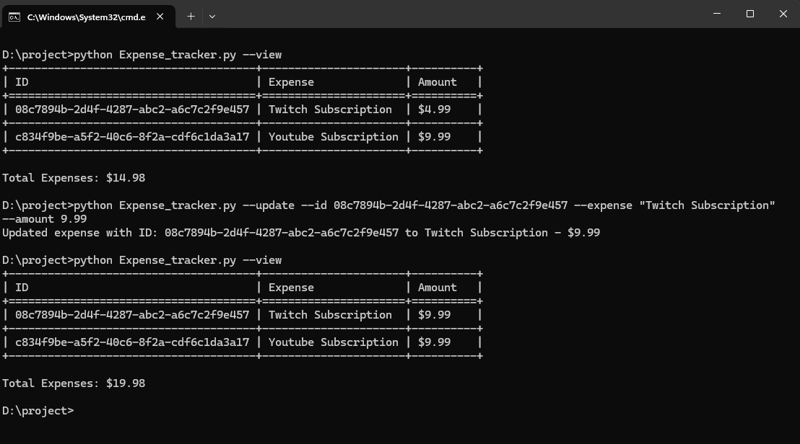
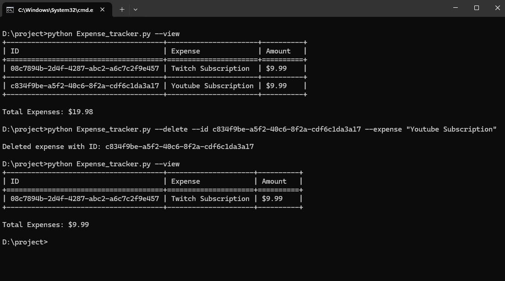

# Expense Tracker CLI

A simple command-line interface (CLI) application to track your expenses. This Python-based tool allows you to add, view, update, and delete expenses, with data stored in a JSON file.

## Features

- Add new expenses with descriptions and amounts
- View all expenses in a formatted table with totals
- Update existing expenses
- Delete expenses
- Data persistence using JSON storage
- Unique ID generation for each expense

## Screenshots

### Viewing Expenses
View all your expenses in a nicely formatted table:



### Adding a New Expense
Add new expenses easily with description and amount:



### Updating an Expense
Update existing expenses by their ID:



### Deleting an Expense
Remove expenses you no longer need:



## Requirements

- Python 3.x
- tabulate (for formatted table display)

## Installation

1. Clone this repository or download the files
2. Install the required package:
```bash
pip install tabulate
```

## Usage

The program supports the following commands:

### View Help
```bash
python Expense_tracker.py --help
```

### Add a New Expense
```bash
python Expense_tracker.py --add --expense "description" --amount value
```
Example:
```bash
python Expense_tracker.py --add --expense "Grocery shopping" --amount 45.50
```

### View All Expenses
```bash
python Expense_tracker.py --view
```

### Update an Expense
```bash
python Expense_tracker.py --update --id <expense-id> --expense "new description" --amount new-value
```
Example:
```bash
python Expense_tracker.py --update --id abc123 --expense "Updated grocery" --amount 50.00
```

### Delete an Expense
```bash
python Expense_tracker.py --delete --id <expense-id>
```
Example:
```bash
python Expense_tracker.py --delete --id abc123
```

## Data Storage

All expenses are stored in `expenses.json` in the same directory as the script. The data format is JSON with the following structure:
```json
[
    {
        "id": "unique-uuid",
        "expense": "description",
        "amount": 123.45
    }
]
```

## Error Handling

The application includes error handling for:
- Invalid command combinations
- Missing required arguments
- Invalid amount values
- File operations
- Data validation

## Contributing

Feel free to fork this project and submit pull requests with improvements.

## License

This project is open source and available under the MIT License.